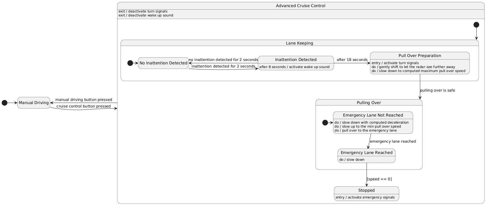

# Sleep detection and safety pull over

## Developers

- Michele Ravaioli
- Alessandro Venturini

## Abstract

We propose a vehicle equipped with an adaptive cruise control system that
includes highway lane-keeping functionality (which, for safety reasons, requires
the driver to remain attentive at all times).

The system we aim to develop will complement the aforementioned functionality by
detecting if the driver falls asleep and, in such cases, safely pulling the
vehicle over to a stop.

Since the described behavior would require the vehicle to safely change lanes to
reach the emergency lane—a task that is inherently complex—we have chosen to
adopt the following simplifying assumption:

The vehicle’s cruise control system is designed to operate only in the slowest
lane (already adjacent to the emergency lane).

## Analisys

We detect driver drowsiness or more generally inattention by leveraging an
artificial vision algorithm based on face detection and analisys.

During pull over preparation we check the following conditions in order to
compute if the vehicle can start pulling over:

- there must be an emergency lane
- for the entire space needed for the maneuver:
  - the emergency lane must be clear of obstacles (vehicles or static obstacles)
  - there should be no entries or entry or exits from the highway

During the whole maneuver and after the vehicle has stopped the driver is
required to press a button in order to go back to manual driving. The reason is
that we want the driver to explicitly express the will of taking control of the
vehicle (it may not be safe to assume that the driver has regained consciousness
by just detecting some movements on the driving wheel or on the pedals).

## Design

Here is a simplified UML state diagram that shows most of the logic of our
system, abstracting away implementation details.


### Safe pull over spot detection

We basically need to achieve two goals and combine their results to decide if a
spot is safe for pulling over.

- Detect the emergency lane and possible highway entries or entry or exits
- Detect if the emergency lane is free of obstacles

Initially we thought about exploiting the guardrail in order to detect the road
boundary. In the end we decided not do use that since guardrails are more likely
to be missing with respect to the emergency lane marking.

We explored two different approaches using different sensors which are described
below.

In order to simplify the examples and the implentation of this project we
decided to assume a right-hand drive context.

#### Camera and radar approach

We exploit a forward looking camera in order to detect a continous (no entry or
exit) lane marking (the emergency lane).

We exploit a long range radar pointing forward with a slight tilt on the right
in order to detect any obstacles in the emergency lane.

1. The camera need to have a free line of sight on the emergency lane line for X
   meters ahead of the vehicle (X meters is the minimum distance for the vehicle
   to be able to stop safely and gently)
2. If the line is not continous throughout all the X meters we assume there is a
   nearby entry or exit -> NOT SAFE
3. The radar projects multiple points ahead for X meters and on the right of the
   vehicle.
4. We only consider points which distance from the lane marking is approximately
   the width of the vehicle (a bit more). This allows us to allow slimmer
   vehicles to pull over even if the emergency lane il smaller in width.
5. If the radar doesn't detect anything, then the pullover is safe. Otherwise,
   there might be an obstacle -> NOT SAFE.

If the vehicle in front is really close to the ego vehicle it may obstruct the
radar making it impossible to see the full emergency lane. In order to mitigate
this problem the vehicle will gently shift to the right reaching the lane
marking.

| Pros            | Cons                                                                                                                                                                     |
| --------------- | ------------------------------------------------------------------------------------------------------------------------------------------------------------------------ |
| Cheaper sensors | Harder to detect a safe pull over spot with high confidence (may result in missing some safe pull over spots)                                                            |
|                 | Harder to detect a safe pull over spot in turning roads (it can still be achieved but it requires the vehicle to slow down to a lower speed when searching for the spot) |

#### Semantic lidar approach

1. The sensor need to have a free line of sight on the emergency lane line for X
   meters ahead of the vehicle (X meters is the minimum distance for the vehicle
   to be able to stop safely and gently)
2. If the line is not continous throughout all the X meters we assume there is a
   nearby entry or exit -> NOT SAFE
3. Now that we have a solid white line we ensure there is enough space for the
   vehicle to pull over (the emergency lane is wide enough).
4. We consider all the sensed points on the other side of the white line and
   then we only consider points which distance from the line (the sensor can
   give us 3D coordinates of the line) is about the width of the vehicle (a bit
   more).
5. We measure the height of each considered point from the ground (approximating
   it with a plane).
6. If there are multiple points which distance from the plane is relevantly
   high, we then assume that there is some obstacle in the emergency lane -> NOT
   SAFE.

| Pros                                                                 | Cons                       |
| -------------------------------------------------------------------- | -------------------------- |
| More resilient on turning roads, even at higher speeds               | Extremely expensive sensor |
| Higher capability of detecting a safe pull over spot with confidence |                            |

We finally decided to apply the first approach in order to make our system
easier to deploy on cheaper vehicles.

## Implementation

### Flexible, smooth and robust pullover

There are three main parameters which then allow to compute most of the
thresholds for the algorihm:

- minimum between each of the sensors maximum functional range
- maximum deceleration that the vehicle should reach while pulling over
- minimum pull over speed

Knowing the sensors maximum range and the maximum deceleration we can compute
the maximum speed the vehicle can keep while searching for a safe pull over
spot. So the vehicle will not start pulling over if the speed is higher than the
computed value.

While the vehicle is searching for a pull over spot it will check if there are
any obstacles or entries/exits in the emergency lane and if so compute their
distance. (We take the minimum between the computed distance and a fixed
distance, for example 10 meters, to take into account the fact that the vehicle
may immediately reach the minimum pull over speed and because of that stop
further than expected) Knowing the current speed and the distance from the next
obstacle or entry/exit it is possible to compute what is the deceleration needed
to stop before that.

If the computed deceleration is higher than what allowed (by the other primary
parameter) then the vehicle will not consider this pull over spot as suitable.
Otherwise the vehicle will start pulling over while also decelerating as
computed.

A minimum pull over speed must be maintained by the vehicle for the whole
maneuver until it reaches the emergency lane and position itself correctly
inside it.

The steering is computed by using Motor Schemas which is a well known control
technique in robotics. It provides flexibility and robustness as the steering is
adjusted as a continuous function.

In this way it is possible to achieve a pull over that:

- is gentle (maximum deceleration)
- is flexible as the space needed to stop depends on the vehicle speed
- robust with respect to how much roads can differ from one another

### Driver inattention detection

An important aspect to consider is the method used to detect driver inattention.
The goal is to reliably determine whether the driver is focused on the road and
to notify the system of their condition.

This is accomplished using a fast and reliable classifier capable of
distinguishing between open and closed eyes. Of course, simply detecting closed
eyes is not sufficient to conclude that the driver is drowsy. Instead, this
detection is monitored over time: a driver is considered drowsy if their eyes
remain closed (or undetected) for a continuous period.

The classifier is reused from a project for the exam of _Artificial Vision_. The
link to the full project is
[this one](https://colab.research.google.com/drive/1C0jCgllFsKzQqjKye22sLj6kz_CnbOdb?usp=sharing).

In this project, the problem is divided into two main stages: **eye detection**
and **state classification**. The most logical strategy involves first detecting
the eyes using a detection algorithm, then using the results to train a
classifier that distinguishes between open and closed eyes.

However, as described in the paper
[_Real-Time Eye Blink Detection using Facial Landmarks_](https://vision.fe.uni-lj.si/cvww2016/proceedings/papers/05.pdf),
this process can be simplified by using a detector that provides both eye
positions and **facial landmarks**. In this case, there is no need to train an
additional classification algorithm—the information from the landmarks can
directly indicate whether the eyes are open or closed, reducing the system's
complexity.

The paper highlights that by using the appropriate facial landmarks, it is
possible to compute the **Eye Aspect Ratio (EAR)**, a geometric metric that
describes the state of the eye. The EAR captures the eye's shape information,
making it an effective indicator for distinguishing between open and closed
eyes.

The system is therefore composed of the following components:

- **Eye Detector**: Detects eye landmarks from an image, based on a small and
  efficient neural network provided by Dlib.
- **Eye Classifier**: Determines the eye state (open or closed) from the
  detected facial landmarks.

The inattention detection module uses this classifier to differentiate between
open and closed eyes. Since the processing time may vary between frames, the
detection does not run inside the camera callback. Instead, it operates in a
separate thread that performs computations asynchronously. This design allows
both the main system and the detector to run independently at their respective
frame rates.

## Testing

We tested our system in multiple scenarios, each of them can be run on CARLA
simulator, to do so refer to the [Usage section](#usage)

Unfortunately we were not able to test our system on an actual highway map
because in that map we experienced serious bugs regarding the radar sensor which
consistently retrieved wrong data. So we choose another map with pretty fast
driving roads but with three aspects that should not realistically be present in
a real highway:

- Some turns are too tight
- It has some semaphores
- Some lanes lead to exits directly (without a need for the car to change lane)

| Scenario | Description                                                                                |
| -------- | ------------------------------------------------------------------------------------------ |
| 1        | Long straight road without any traffic, with obstacles in the emergency lane               |
| 2        | Long turning road without any traffic, with obstacles in the emergency lane                |
| 3        | Long straight road with traffic and obstacles in the emergency lane                        |
| 4        | Long turning road with traffic and obstacles in the emergency lane                         |
| 5        | Long straight and then turning road jammed by traffic with obstacles in the emergency lane |

Except for those cases listed in the [Edge cases section](#edge-cases) we did
not experience any failure or crash.

> **Note:**
>
> In all scenarios which present traffic we had to manually set the maximum
> speed of the ego vehicle because the autopilot was not able to keep a steady
> speed when following another vehicle

## Edge cases

There are some edge cases that we did not cover due to time constraints:

- If the ego vehicle is going really slow and there is an obstacle in the
  emergency lane, it may happen that the ego vehicle will pull over right after
  the radar has surpassed the obstacle resulting in the obstacle being hit. This
  issue can be easilly solved by complementing the main radar with a short range
  radar on the side of the vehicle.

## Usage

### Setup virtual environment

```sh
conda create -p ./.venv python=3.12
conda activate ./.venv
```

### Install requirements

```sh
pip install -r requirements.txt
```

### Run

```sh
python ./src/run_scenario.py --help
# Will print all the available scenarios to showcase our system along their id

# Even though it is not necessary for testing, our system requires a webcam.
# You should specify which one to use when running a scenario.
# Here is how you can list all the connected webcams.
ls /dev/video*
# /dev/video0 /dev/video1 /dev/video2

# camera_device can be the specific device file (ex: /dev/video1) or just the
# index of the device (ex: 2)
python ./src/run_scenario.py -camera_device <camera_device> <scenario_id>
# Will run the appropriate scenario

^C # To stop the scenario
```

A black window will pop up, in order to send any keystroke to the simulator you
must have that window in focus.

| Key        | Action                                             |
| ---------- | -------------------------------------------------- |
| m          | Go into manual driving                             |
| arrow keys | Control the vehicle while in manual driving mode   |
| c          | Activate adaptive cruise control                   |
| p          | Force a pull over (even if the driver is conscious |

We do not support driving wheel controls as our system is supposed to work when
the driver is not directly controlling the vehicle.

We used the simulator spectator as the main camera, we choose to do so in order
to ease development by reducing the load on the hardware.
